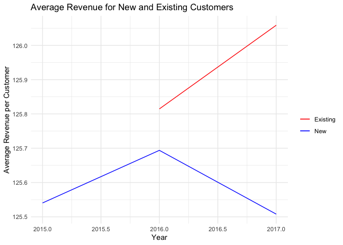
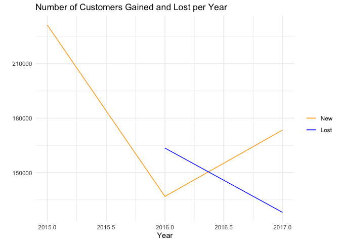
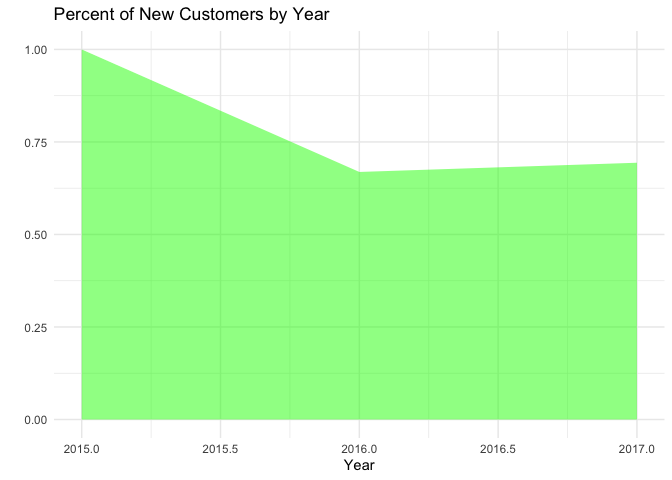

## Setup


```r
# load packages
library(tidyverse)
library(ggthemes)
theme_set(theme_minimal())
```


```r
# read in data
orders <- read_csv("casestudy.csv")
```

## Data Cleaning and Manipulation


```r
# create output data and add year to output
year <- orders %>%
  select(year) %>%
  unique()
output <- tibble(year)
output$year <- as.integer(output$year)
```


```r
# compute total revenue
total_revenue <- orders %>%
  group_by(year) %>%
  mutate(total_revenue = sum(net_revenue)) %>%
  select(total_revenue, year) %>%
  unique()
```


```r
# add total revenue to output
output <- output %>%
  left_join(total_revenue, by = "year")
```


```r
# add boolean column new_customer to orders
orders <- orders %>%
  group_by(customer_email) %>%
  mutate(new_customer = case_when(year == min(year) ~ TRUE, year > min(year) ~ FALSE))
```


```r
# compute new customer revenue
new_customer_revenue <- orders %>%
  filter(new_customer == TRUE) %>%
  group_by(year) %>%
  mutate(new_customer_revenue = sum(net_revenue)) %>%
  select(new_customer_revenue, year) %>%
  unique()
```


```r
# add new customer revenue to output
output <- output %>%
  left_join(new_customer_revenue, by = "year")
```


```r
# compute existing customer growth and add to output
output <- output %>%
  arrange(year) %>%
  mutate(existing_customer_growth = (total_revenue - new_customer_revenue) - (lag(total_revenue) - lag(new_customer_revenue)))
```


```r
# compute revenue lost from attrition and add to output
output <- output %>%
  arrange(year) %>%
  mutate(revenue_lost_attrition = lag(total_revenue) - (total_revenue - new_customer_revenue))
```


```r
# compute existing customer revenue and add to output
output <- output %>%
  mutate(existing_customer_revenue = total_revenue - new_customer_revenue)
```


```r
# compute existing customer revenue prior year and add to ouput
output <- output %>%
  arrange(year) %>%
  mutate(existing_customer_revenue_prior = lag(total_revenue) - lag(new_customer_revenue))
```


```r
# compute total customers and total customers prior
total_customers <- orders %>%
  group_by(year) %>%
  mutate(total_customers = n()) %>%
  select(total_customers, year) %>%
  unique() %>%
  ungroup() %>%
  arrange(year) %>%
  mutate(total_customers_prior = lag(total_customers))
```


```r
# add total customers and total customers prior to output
output <- output %>%
  left_join(total_customers, by = "year")
```


```r
# compute new customers
new_customers <- orders %>%
  filter(new_customer == TRUE) %>%
  group_by(year) %>%
  mutate(new_customers = n()) %>%
  select(new_customers, year) %>%
  unique()
```


```r
# add new customers to output
output <- output %>%
  left_join(new_customers, by = "year")
```


```r
# compute lost customers and add to output
output <- output %>%
  arrange(year) %>%
  mutate(lost_customers = lag(total_customers) - (total_customers - new_customers))
```

## Final Output


```r
# final table of information
output
```

<div data-pagedtable="false">
  <script data-pagedtable-source type="application/json">
{"columns":[{"label":["year"],"name":[1],"type":["dbl"],"align":["right"]},{"label":["total_revenue"],"name":[2],"type":["dbl"],"align":["right"]},{"label":["new_customer_revenue"],"name":[3],"type":["dbl"],"align":["right"]},{"label":["existing_customer_growth"],"name":[4],"type":["dbl"],"align":["right"]},{"label":["revenue_lost_attrition"],"name":[5],"type":["dbl"],"align":["right"]},{"label":["existing_customer_revenue"],"name":[6],"type":["dbl"],"align":["right"]},{"label":["existing_customer_revenue_prior"],"name":[7],"type":["dbl"],"align":["right"]},{"label":["total_customers"],"name":[8],"type":["int"],"align":["right"]},{"label":["total_customers_prior"],"name":[9],"type":["int"],"align":["right"]},{"label":["new_customers"],"name":[10],"type":["int"],"align":["right"]},{"label":["lost_customers"],"name":[11],"type":["int"],"align":["right"]}],"data":[{"1":"2015","2":"29036749","3":"29036749","4":"NA","5":"NA","6":"0","7":"NA","8":"231294","9":"NA","10":"231294","11":"NA"},{"1":"2016","2":"25730944","3":"17206367","4":"8524577","5":"20512172","6":"8524577","7":"0","8":"204646","9":"231294","10":"136891","11":"163539"},{"1":"2017","2":"31417495","3":"21769213","4":"1123705","5":"16082662","6":"9648282","7":"8524577","8":"249987","9":"204646","10":"173449","11":"128108"}],"options":{"columns":{"min":{},"max":[10]},"rows":{"min":[10],"max":[10]},"pages":{}}}
  </script>
</div>

## Visualizations and Observations


```r
output %>%
  ggplot() +
  geom_line(aes(x = year, y = new_customer_revenue/new_customers, color = "New")) +
  geom_line(aes(x = year, y = (total_revenue - new_customer_revenue)/ (total_customers - new_customers), , color = "Existing")) +
  labs(x = "Year", y = "Average Revenue per Customer", title = "Average Revenue for New and Existing Customers") +
  scale_color_manual("", breaks = c("Existing", "New"), values = c("Existing" = "red", "New" = "blue"))
```

<!-- -->

Existing customers tend to generate more revenue on average over sample.


```r
output %>%
  ggplot() +
  geom_line(aes(x = year, y = new_customers, color = "New")) +
  geom_line(aes(x = year, y = lost_customers, color = "Lost")) +
  labs(x = "Year", y = "", title = "Number of Customers Gained and Lost per Year") +
  scale_color_manual("", breaks = c("New", "Lost"), values = c("Lost" = "blue", "New" = "orange"))
```

<!-- -->

In 2016, more customers were lost than gained, but in 2017, more customers were gained.


```r
output %>%
  ggplot() +
  geom_area(aes(x = year, y = new_customers / total_customers), fill = "green", alpha = .5) +
  labs(x = "Year", y = "", title = "Percent of New Customers by Year")
```

<!-- -->

The percent of total customers that are new customers is somewhat constant around 66% after the first year.
